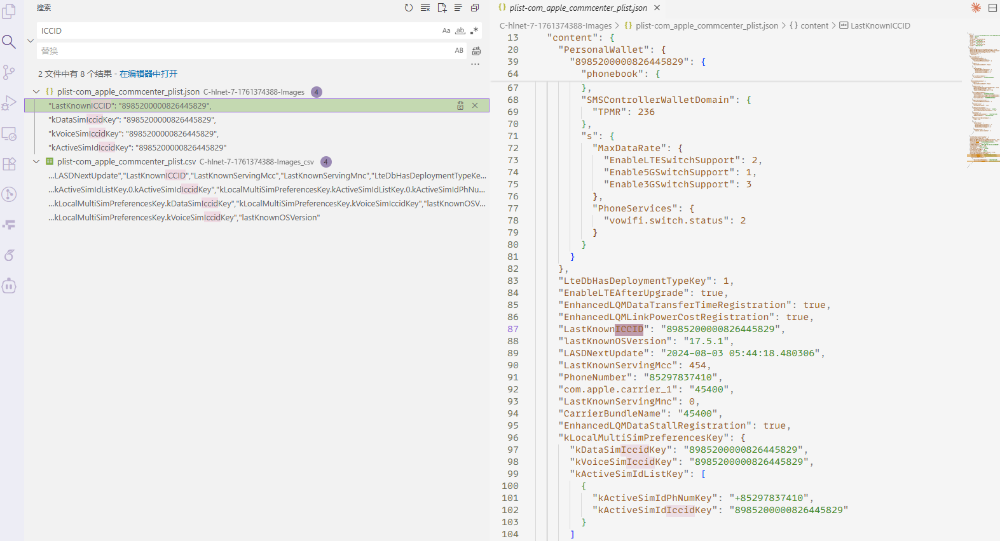
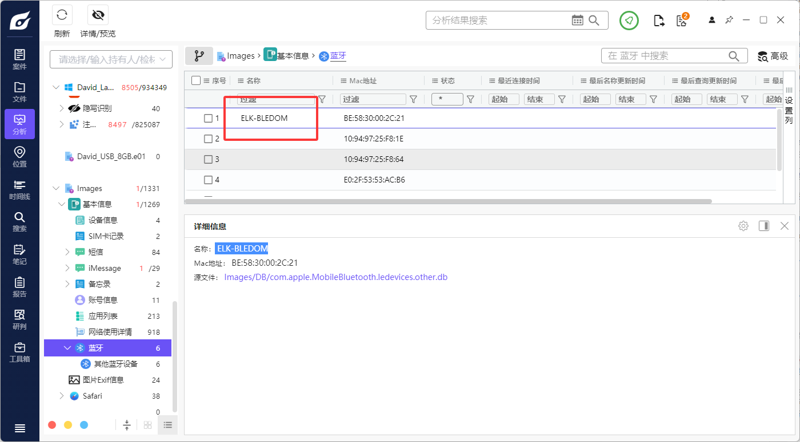
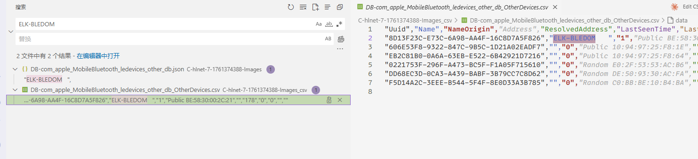

# Example

Hers're some use cases for dbs2json in `MeiyaCup 2024 Individual Competition`.

The evidence material Emma_Mobile.zip associated with the questions in the first part of the competition is a collection of files. The database files (in the DB directory) and plist files (in the plist directory) are classified by file type. It is not an image file itself, but only some files from the file system (in the Active directory) have been extracted. Therefore, putting the entire compressed package into forensic software for automatic forensics will also lack a lot of information.
``` plaintext
(base) PS F:\2024meiya\individual runtime\Emma_Mobile_Image> tree
F:.
└─Images
    ├─Active
    │  └─var
    │      └─mobile
    │          └─Applications
    │              └─group.com.tencent.xin
    │                  ├─Document
    │                  │  └─02a951e5aa009ee836c3c1e32b136b21
    │                  │      └─Img
    │                  │          └─f6b680e85ab3ca24f9da291a870b72bf
    │                  └─Library
    │                      └─Preferences
    ├─DB
    └─plist
```

Then the dbs2json tool was used for analysis:

``` bash
python .\main.py -i C:\hlnet\7-1761374388\Images -o "F:\2024meiya\individual runtime\emma phone dbs" -f csv --verbose
```     

## Use Case 1: 在 2024 年, Emma 手机上曾记录的电话卡集成电路卡标识符(ICCID)是多少? / What is the ICCID of the integrated circuit card (ICC) that Emma's phone has recorded in 2024?



## Use Case 2: Emma 手机的蓝牙设备名称"ELK-BLEDOM"的通用唯一标识符(UUID)是什么? / What is the universal unique identifier (UUID) of the Bluetooth device named "ELK-BLEDOM" on Emma's phone?





## More Use Cases

I'm very curious about your ideas for more use cases. Please feel free to offer more use cases or feedbacks.